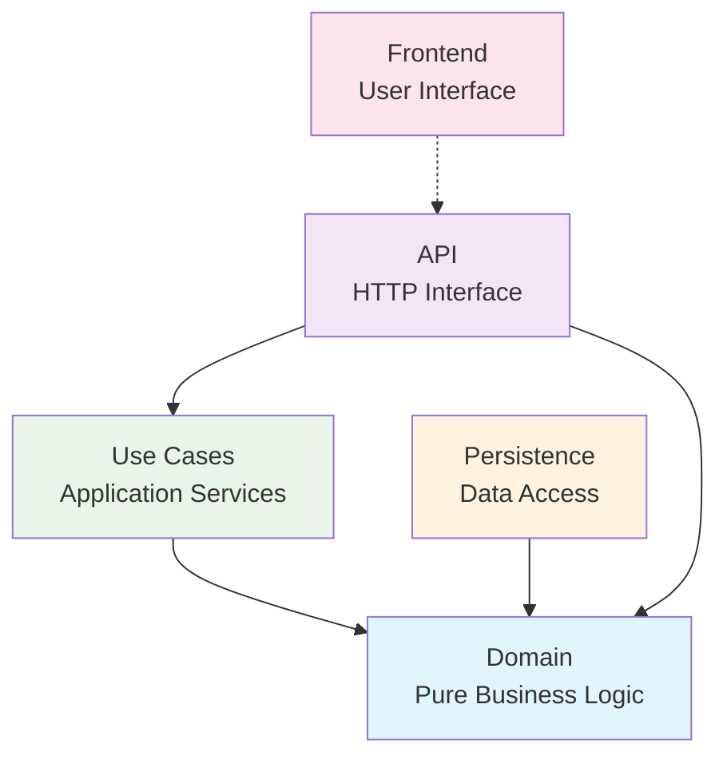
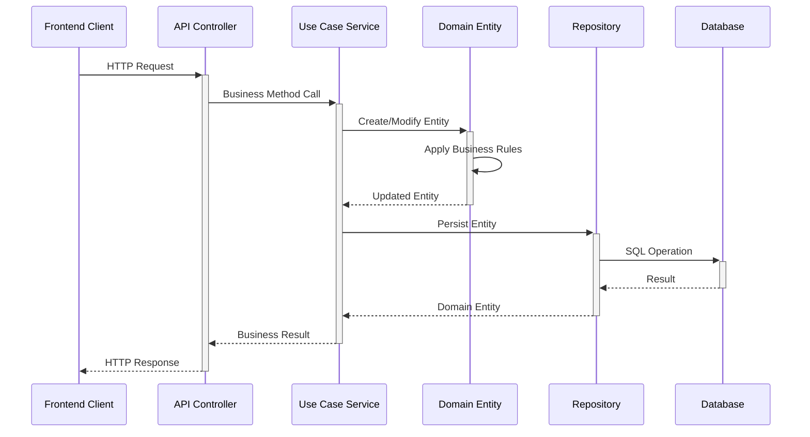
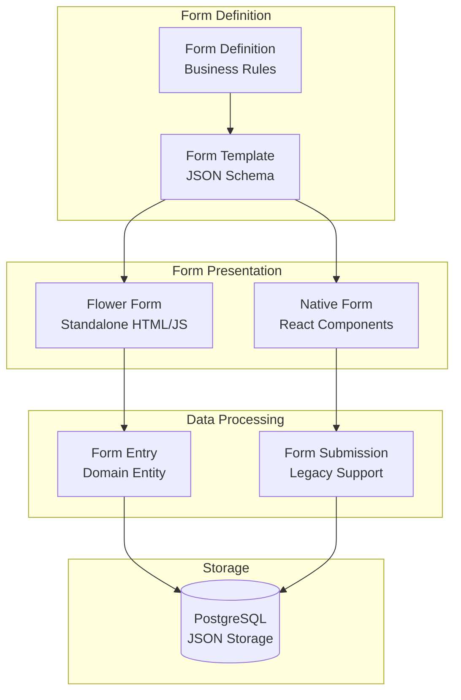
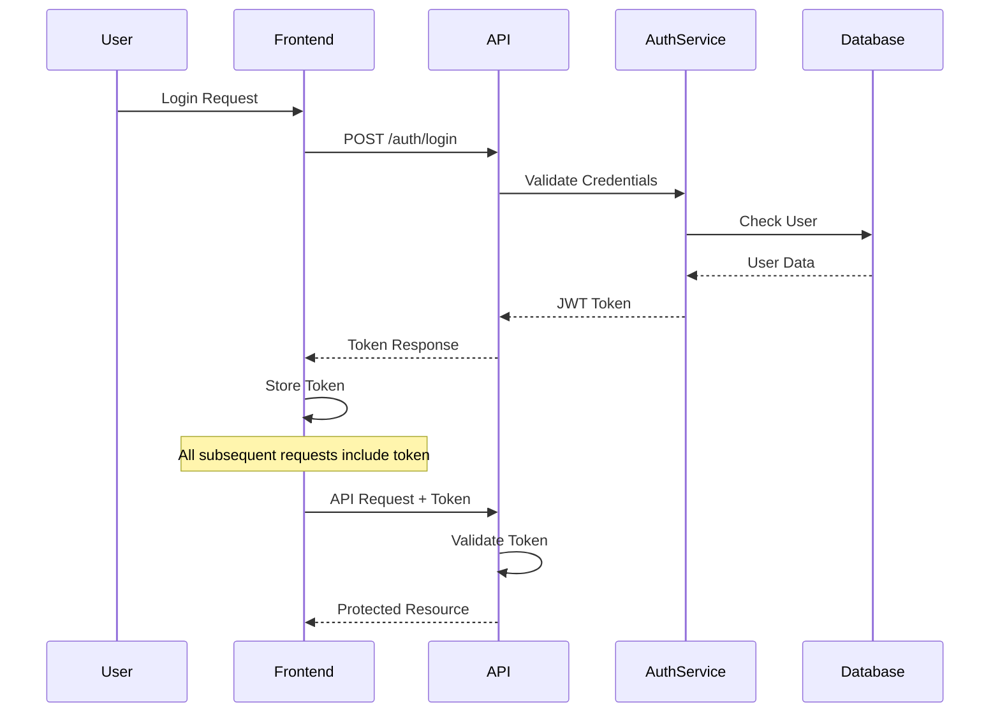
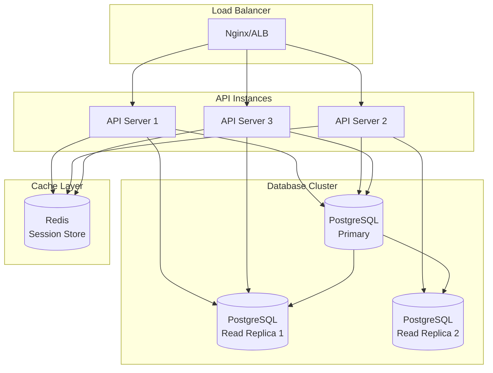
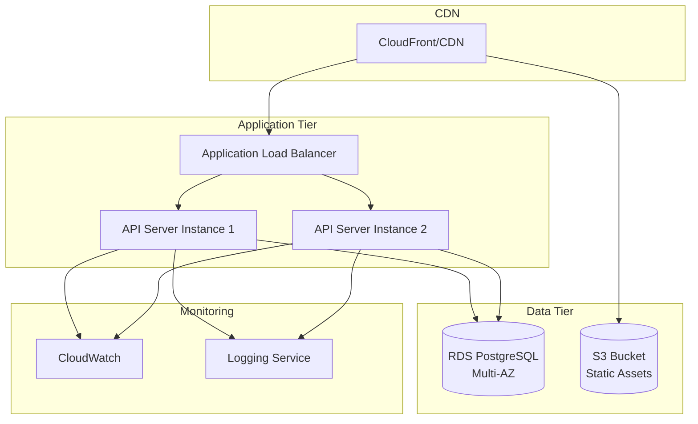
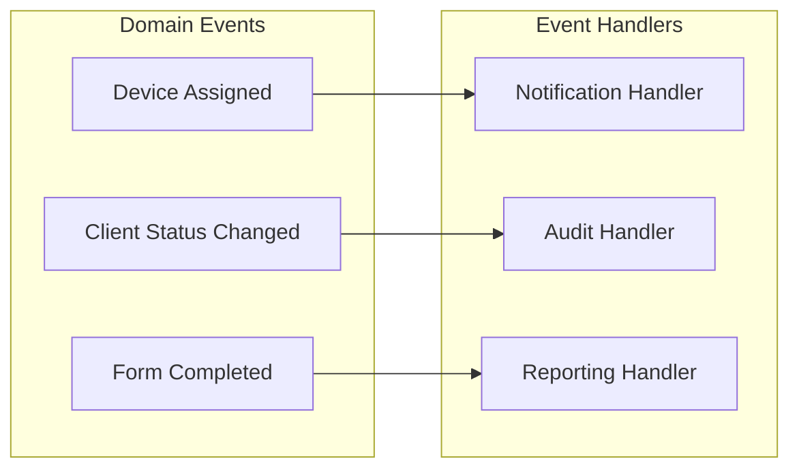
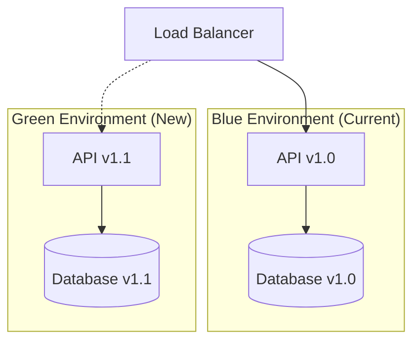

# System Architecture Documentation

## Architecture Overview

CUIS (Cosyma Unified Info-System) is built using Clean Architecture principles with Domain-Driven Design (DDD) patterns. The system is designed to be modular, testable, and maintainable while providing comprehensive functionality for medical device and patient management.

## Architectural Principles

### Clean Architecture

The system follows Uncle Bob's Clean Architecture pattern:

1. **Independence**: Business rules don't depend on external frameworks
2. **Testability**: Business rules can be tested without UI, database, or external elements
3. **Framework Independence**: Architecture doesn't depend on specific frameworks
4. **Database Independence**: Business rules don't know about the database

### Domain-Driven Design (DDD)

The system applies DDD concepts:

1. **Ubiquitous Language**: Common vocabulary between developers and domain experts
2. **Domain Models**: Rich models that encapsulate business logic
3. **Bounded Contexts**: Clear boundaries between different parts of the system
4. **Repository Pattern**: Abstraction over data access

## System Layers

### 1. Domain Layer (`@cuis/domain`)

**Responsibility**: Core business logic and rules

```typescript
// Domain Entity Example
export class Device {
  private constructor(data: Partial<Device>) {
    // Validation and initialization
  }
  
  assignToPatient(patientId: string): void {
    // Business rule: Only active devices can be assigned
    if (!this.isActive()) {
      throw new Error('Cannot assign inactive device');
    }
    this.assignedPatientId = patientId;
    this.updatedAt = new Date();
  }
}
```

**Characteristics**:
- No external dependencies
- Rich domain models with business logic
- Interfaces (ports) for external dependencies
- Value objects and domain services

### 2. Application Layer (`@cuis/use-cases`)

**Responsibility**: Application business logic and use case orchestration

```typescript
// Use Case Service Example
@Injectable()
export class DeviceService {
  constructor(private deviceRepo: DeviceRepositoryPort) {}
  
  async assignDeviceToPatient(deviceId: string, patientId: string): Promise<Device> {
    // Orchestrate domain entities
    const device = await this.deviceRepo.findById(deviceId);
    device.assignToPatient(patientId);
    return await this.deviceRepo.update(device.id, device);
  }
}
```

**Characteristics**:
- Orchestrates domain entities
- Implements business workflows
- Manages transaction boundaries
- Handles cross-cutting concerns

### 3. Infrastructure Layer (`@cuis/persistence`)

**Responsibility**: Implementation of external concerns (database, external APIs)

```typescript
// Repository Implementation Example
@Injectable()
export class DeviceRepository implements DeviceRepositoryPort {
  constructor(private db: DatabaseService) {}
  
  async create(device: Device): Promise<Device> {
    const dbData = this.mapToDatabase(device);
    const result = await this.db.knex('devices').insert(dbData).returning('*');
    return this.mapToDomain(result[0]);
  }
}
```

**Characteristics**:
- Implements ports defined in domain
- Handles database operations
- Manages external service integrations
- Data transformation and mapping

### 4. Presentation Layer (`@cuis/api` + `@cuis/frontend`)

**Responsibility**: User interface and external interfaces

```typescript
// API Controller Example
@Controller('devices')
export class DevicesController {
  constructor(private deviceService: DeviceService) {}
  
  @Post(':id/assign-patient')
  async assignPatient(@Param('id') id: string, @Body() dto: AssignPatientDto) {
    return await this.deviceService.assignDeviceToPatient(id, dto.patientId);
  }
}
```

## Dependency Rules

### Dependency Direction

```
Frontend ──→ API ──→ Use Cases ──→ Domain
                 ↗              ↘
            Persistence ────────→ Domain
```

**Rules**:
- Dependencies point inward toward the domain
- Domain has no dependencies on outer layers
- Infrastructure implements interfaces defined by domain
- Use cases orchestrate domain entities

### Package Dependencies



## Data Flow Architecture

### Request Processing Flow



### Form Processing Architecture



## Security Architecture

### Authentication Flow



### Authorization Model

```typescript
// Role-based access control
enum UserRole {
  ADMIN = 'admin',
  CLINICIAN = 'clinician',
  THERAPIST = 'therapist',
  VIEWER = 'viewer'
}

// Permission-based access
interface Permission {
  resource: string;
  action: string;
  conditions?: Record<string, any>;
}
```

## Scalability Considerations

### Horizontal Scaling



### Performance Patterns

**Caching Strategy**:
- Redis for session storage
- Application-level caching for frequently accessed data
- Database query optimization with proper indexing

**Connection Pooling**:
- PostgreSQL connection pool (min: 2, max: 10)
- Connection reuse across requests
- Automatic connection lifecycle management

## Deployment Architecture

### Development Environment

```yaml
# docker-compose.yml
version: '3.8'
services:
  postgres:
    image: postgres:15
    environment:
      POSTGRES_DB: cuis
      POSTGRES_USER: cuis
      POSTGRES_PASSWORD: cuis
    ports:
      - "5432:5432"
    
  api:
    build: ./packages/api-server
    ports:
      - "3002:3002"
    environment:
      NODE_ENV: development
      POSTGRES_HOST: postgres
    depends_on:
      - postgres
      
  frontend:
    build: ./packages/frontend  
    ports:
      - "5173:5173"
    environment:
      VITE_API_BASE_URL: http://localhost:3002/api
```

### Production Deployment



## Error Handling Architecture

### Error Flow

```typescript
// Domain Layer
export class DomainError extends Error {
  constructor(message: string, code: string) {
    super(message);
    this.name = 'DomainError';
    this.code = code;
  }
}

// Application Layer  
export class ApplicationError extends Error {
  constructor(message: string, cause?: Error) {
    super(message);
    this.name = 'ApplicationError';
    this.cause = cause;
  }
}

// API Layer
@Controller()
export class EntityController {
  @Post()
  async create(@Body() dto: CreateDto) {
    try {
      return await this.service.create(dto);
    } catch (error) {
      if (error instanceof DomainError) {
        throw new BadRequestException(error.message);
      }
      throw new InternalServerErrorException('Internal server error');
    }
  }
}
```

### Error Response Format

```typescript
// Standardized error response
interface ErrorResponse {
  statusCode: number;
  message: string;
  error: string;
  timestamp: string;
  path: string;
  details?: Record<string, any>;
}
```

## Monitoring and Observability

### Logging Strategy

```typescript
// Structured logging
import { Logger } from '@nestjs/common';

@Injectable()
export class DeviceService {
  private readonly logger = new Logger(DeviceService.name);
  
  async createDevice(data: CreateDeviceDto): Promise<Device> {
    this.logger.log(`Creating device with serial: ${data.serial}`);
    
    try {
      const device = await this.deviceRepo.create(new Device(data));
      this.logger.log(`Device created successfully: ${device.id}`);
      return device;
    } catch (error) {
      this.logger.error(`Failed to create device: ${error.message}`, error.stack);
      throw error;
    }
  }
}
```

### Health Checks

```typescript
// Health check endpoints
@Controller('health')
export class HealthController {
  constructor(private db: DatabaseService) {}
  
  @Get()
  async check() {
    return {
      status: 'ok',
      timestamp: new Date().toISOString(),
      services: {
        database: await this.checkDatabase(),
        api: 'healthy'
      }
    };
  }
  
  private async checkDatabase(): Promise<string> {
    try {
      await this.db.knex.raw('SELECT 1');
      return 'healthy';
    } catch {
      return 'unhealthy';
    }
  }
}
```

## Integration Patterns

### Event-Driven Architecture (Future)



### External Service Integration

```typescript
// Example: External notification service
@Injectable()
export class NotificationService {
  constructor(
    private httpService: HttpService,
    private configService: ConfigService
  ) {}
  
  async sendDeviceAlert(device: Device, alertType: string): Promise<void> {
    const endpoint = this.configService.get('NOTIFICATION_SERVICE_URL');
    
    await this.httpService.post(endpoint, {
      deviceId: device.id,
      alertType,
      timestamp: new Date(),
      metadata: {
        serial: device.serial,
        location: device.currentLocation
      }
    }).toPromise();
  }
}
```

## Data Architecture

### Storage Strategy

**Relational Data**:
- Core entities (Device, Client, Form Template)
- Relationships and foreign keys
- Indexed fields for performance

**JSON Storage**:
- Form submission data (flexible schema)
- Configuration settings
- Audit trails and metadata

**File Storage**:
- Static assets (Flower Form files)
- Generated reports
- User uploads

### Data Consistency

**Transaction Boundaries**:
```typescript
// Use case service with transaction
@Injectable()
export class FormSubmissionService {
  async submitForm(data: FormSubmissionData): Promise<FormEntry> {
    return await this.db.knex.transaction(async (trx) => {
      // Create form entry
      const entry = await this.formEntryRepo.create(data.entry, trx);
      
      // Update related entities
      if (data.deviceId) {
        await this.deviceRepo.updateLastActivity(data.deviceId, trx);
      }
      
      // Generate notifications
      await this.notificationService.sendFormCompletedAlert(entry, trx);
      
      return entry;
    });
  }
}
```

## Security Architecture

### Authentication & Authorization

```typescript
// JWT-based authentication
@Injectable()
export class AuthGuard implements CanActivate {
  canActivate(context: ExecutionContext): boolean {
    const request = context.switchToHttp().getRequest();
    const token = this.extractTokenFromHeader(request);
    
    if (!token) return false;
    
    try {
      const payload = this.jwtService.verify(token);
      request.user = payload;
      return true;
    } catch {
      return false;
    }
  }
}

// Role-based authorization
@Injectable()
export class RolesGuard implements CanActivate {
  canActivate(context: ExecutionContext): boolean {
    const requiredRoles = this.reflector.get<string[]>('roles', context.getHandler());
    const user = context.switchToHttp().getRequest().user;
    
    return requiredRoles.some(role => user.roles?.includes(role));
  }
}
```

### Data Security

**Encryption at Rest**:
- Database-level encryption for sensitive fields
- Environment variable encryption for secrets
- File system encryption for uploads

**Encryption in Transit**:
- HTTPS for all API communications
- WSS for WebSocket connections
- TLS for database connections

## Performance Architecture

### Caching Strategy

```typescript
// Application-level caching
@Injectable()
export class CacheService {
  private cache = new Map<string, { data: any; expiry: number }>();
  
  async get<T>(key: string, factory: () => Promise<T>, ttl = 300000): Promise<T> {
    const cached = this.cache.get(key);
    
    if (cached && Date.now() < cached.expiry) {
      return cached.data;
    }
    
    const data = await factory();
    this.cache.set(key, { data, expiry: Date.now() + ttl });
    return data;
  }
}
```

### Database Optimization

**Indexing Strategy**:
```sql
-- Performance indexes
CREATE INDEX idx_devices_status ON devices (status);
CREATE INDEX idx_devices_assigned_patient ON devices (assigned_patient_id);
CREATE INDEX idx_form_entries_patient_form ON form_entries (patient_id, form_id);

-- JSON indexes for flexible queries
CREATE INDEX idx_form_entries_data_gin ON form_entries USING GIN (data);
```

**Query Optimization**:
```typescript
// Efficient pagination
async findAllWithPagination(options: PaginationOptions): Promise<PaginatedResult<Device>> {
  const offset = (options.page - 1) * options.limit;
  
  const [data, countResult] = await Promise.all([
    this.db.knex('devices')
      .offset(offset)
      .limit(options.limit)
      .orderBy(options.sortBy || 'created_at', options.sortOrder || 'desc'),
    this.db.knex('devices').count('id as count').first()
  ]);
  
  return {
    data: data.map(this.mapToDomain),
    pagination: {
      page: options.page,
      limit: options.limit,
      total: Number(countResult.count),
      totalPages: Math.ceil(Number(countResult.count) / options.limit)
    }
  };
}
```

## Extensibility Architecture

### Plugin System (Future)

```typescript
// Plugin interface
export interface CuisPlugin {
  name: string;
  version: string;
  initialize(app: INestApplication): Promise<void>;
  destroy(): Promise<void>;
}

// Plugin registry
@Injectable()
export class PluginRegistry {
  private plugins = new Map<string, CuisPlugin>();
  
  async registerPlugin(plugin: CuisPlugin): Promise<void> {
    await plugin.initialize(this.app);
    this.plugins.set(plugin.name, plugin);
  }
}
```

### Module System

```typescript
// Feature module pattern
@Module({
  imports: [
    DomainModule,
    PersistenceModule,
    UseCasesModule
  ],
  controllers: [FeatureController],
  providers: [FeatureService],
  exports: [FeatureService]
})
export class FeatureModule {}
```

## Deployment Patterns

### Blue-Green Deployment



### Rolling Updates

```typescript
// Health check for rolling updates
@Controller('health')
export class HealthController {
  @Get('ready')
  async readinessCheck() {
    // Check if application is ready to serve traffic
    const dbHealth = await this.checkDatabase();
    const dependenciesHealth = await this.checkDependencies();
    
    if (dbHealth && dependenciesHealth) {
      return { status: 'ready' };
    }
    throw new ServiceUnavailableException('Not ready');
  }
}
```

## Monitoring Architecture

### Metrics Collection

```typescript
// Custom metrics
@Injectable()
export class MetricsService {
  private counters = new Map<string, number>();
  
  incrementCounter(name: string): void {
    this.counters.set(name, (this.counters.get(name) || 0) + 1);
  }
  
  getMetrics(): Record<string, number> {
    return Object.fromEntries(this.counters);
  }
}

// Usage in services
@Injectable()
export class DeviceService {
  constructor(private metrics: MetricsService) {}
  
  async createDevice(data: CreateDeviceDto): Promise<Device> {
    this.metrics.incrementCounter('devices.created');
    // ... implementation
  }
}
```

This architecture documentation provides a comprehensive understanding of how the CUIS system is structured, how components interact, and how to extend the system while maintaining architectural integrity.