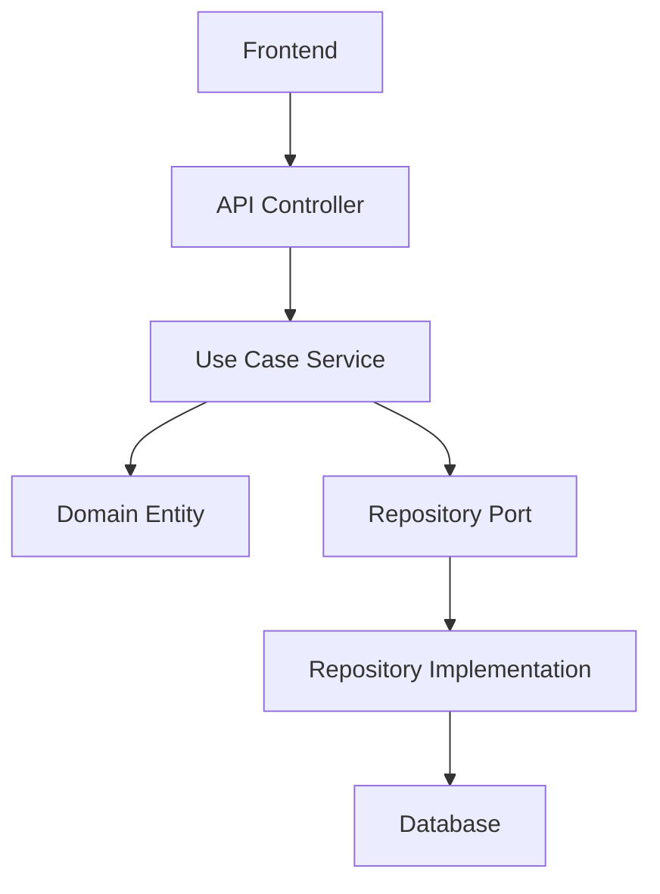

# Package Reference Guide

## Overview

The Reki monorepo is organized into distinct packages following Clean Architecture principles. Each package has a specific responsibility and clear dependency boundaries.

## Package Hierarchy

```
@reki/
├── domain          # Core business logic (no dependencies)
├── persistence     # Data access layer (depends on domain)
├── use-cases       # Application services (depends on domain)
├── api             # REST API layer (depends on domain, use-cases)
└── frontend        # React UI (communicates with api)
```

## Package Descriptions

### @reki/domain

**Version**: 0.1.0  
**Purpose**: Core business domain models, entities, and port interfaces  
**Dependencies**: None (pure TypeScript)

#### Structure

```
src/
├── models/           # Domain entities and value objects
│   ├── client.model.ts       # Client/Patient domain entity
│   ├── device.model.ts       # Medical device domain entity
│   ├── form.model.ts         # Form template domain entity
│   ├── form-entry.model.ts   # Form submission domain entity
│   └── examination.model.ts  # Examination-specific entities
├── ports/            # Interface definitions for external dependencies
│   ├── client-repository.port.ts    # Client data access interface
│   ├── device-repository.port.ts    # Device data access interface
│   ├── form-repository.port.ts      # Form data access interface
│   └── form-entry-repository.port.ts # Form entry data access interface
├── tokens.ts         # Dependency injection tokens
└── index.ts          # Package exports
```

#### Key Exports

```typescript
// Domain Entities
export { Device, DeviceStatus } from './models/device.model';
export { Client, ClientStatus } from './models/client.model';
export { FormModel, FormStatus, FormType } from './models/form.model';
export { FormEntryModel, FormEntryStatus } from './models/form-entry.model';

// Repository Ports
export { DeviceRepositoryPort } from './ports/device-repository.port';
export { ClientRepositoryPort } from './ports/client-repository.port';
export { IFormRepository } from './ports/form-repository.port';
export { IFormEntryRepository } from './ports/form-entry-repository.port';

// Common Types
export { PaginatedResult, PaginationOptions } from './types/common';
```

#### Business Rules

- All entities include audit fields (`createdAt`, `updatedAt`)
- Status transitions are controlled by entity methods
- Validation logic is embedded in domain entities
- No external framework dependencies

#### Usage Example

```typescript
import { Device, DeviceStatus } from '@reki/domain';

const device = new Device({
  serial: 'DEV001',
  model: 'RehabDevice Pro',
  status: DeviceStatus.REGISTERED,
});

device.assignToPatient('patient-123');
console.log(device.status); // Automatically updated with timestamp
```

---

### @reki/persistence

**Version**: 0.1.0  
**Purpose**: Data persistence implementation using PostgreSQL and Knex.js  
**Dependencies**: `@reki/domain`, `knex`, `pg`

#### Structure

```
src/
├── database/         # Database connection and configuration
│   ├── database.service.ts    # Knex.js database service
│   └── migrations/            # Database schema migrations
├── repositories/     # Repository pattern implementations
│   ├── client.repository.ts         # Client data access implementation
│   ├── device.repository.ts         # Device data access implementation
│   ├── form.repository.ts           # Form data access implementation
│   ├── form-entry.repository.ts     # Form entry data access implementation
│   └── form-submission.repository.ts # Legacy form submission support
├── utils/            # Utility functions
│   └── case-converter.ts      # camelCase ↔ snake_case conversion
├── persistence.module.ts      # NestJS module configuration
└── index.ts          # Package exports
```

#### Key Features

- **Repository Pattern**: Implements domain-defined repository ports
- **Case Conversion**: Automatic camelCase ↔ snake_case mapping
- **Connection Pooling**: Optimized PostgreSQL connection management
- **Migration Support**: Knex.js-based database schema management
- **Transaction Support**: Database transaction handling

#### Configuration

```typescript
// Database connection via environment variables
POSTGRES_HOST = localhost;
POSTGRES_PORT = 5432;
POSTGRES_USER = reki;
POSTGRES_PASSWORD = reki;
POSTGRES_DB = reki;
```

#### Usage Example

```typescript
import { DeviceRepository } from '@reki/persistence';
import { Device } from '@reki/domain';

@Injectable()
export class SomeService {
  constructor(private deviceRepo: DeviceRepository) {}

  async createDevice(deviceData: Partial<Device>) {
    const device = new Device(deviceData);
    return await this.deviceRepo.create(device);
  }
}
```

---

### @reki/use-cases

**Version**: 0.1.0  
**Purpose**: Application business logic and use case implementations  
**Dependencies**: `@reki/domain`, `uuid`

#### Structure

```
src/
├── services/         # Application service implementations
│   ├── client.service.ts     # Client management business logic
│   ├── device.service.ts     # Device management business logic
│   ├── form.service.ts       # Form template management
│   └── form-entry.service.ts # Form submission management
├── application.module.ts     # Legacy NestJS module
├── use-cases.module.ts       # Main NestJS module configuration
└── index.ts          # Package exports
```

#### Key Responsibilities

- **Business Logic Orchestration**: Coordinates multiple domain entities
- **Transaction Management**: Handles business transaction boundaries
- **Validation**: Applies business rule validation
- **Error Handling**: Manages application-level errors

#### Service Patterns

**Standard Service Structure**:

```typescript
@Injectable()
export class EntityService {
  constructor(private readonly entityRepository: EntityRepositoryPort) {}

  async createEntity(data: Partial<Entity>): Promise<Entity> {
    // Business validation
    // Create domain entity
    // Persist via repository
    // Return result
  }

  async updateEntity(id: string, data: Partial<Entity>): Promise<Entity> {
    // Fetch existing entity
    // Apply business rules
    // Update and persist
    // Return updated entity
  }
}
```

#### Usage Example

```typescript
import { ClientService } from '@reki/use-cases';

@Controller('clients')
export class ClientsController {
  constructor(private clientService: ClientService) {}

  @Post()
  async create(@Body() data: CreateClientDto) {
    return await this.clientService.createClient(data);
  }
}
```

---

### @reki/api

**Version**: 0.1.0  
**Purpose**: REST API controllers and Data Transfer Objects  
**Dependencies**: `@reki/domain`, `@reki/use-cases`, `class-validator`, `class-transformer`

#### Structure

```
src/
├── devices/          # Device management endpoints
│   ├── devices.controller.ts   # Device CRUD operations
│   └── dto/                    # Device DTOs
├── forms/            # Form management endpoints
│   ├── forms.controller.ts             # Form template operations
│   ├── form-entries.controller.ts      # Form submission operations
│   ├── form-submissions.controller.ts  # Legacy form integration
│   ├── dto/                            # Form DTOs
│   └── seed/                           # Default form templates
├── common/           # Shared API utilities
│   ├── dto-converter.ts        # DTO transformation utilities
│   └── pagination.dto.ts       # Pagination DTOs
├── api.module.ts     # NestJS module configuration
└── index.ts          # Package exports
```

#### Key Features

- **Swagger Documentation**: Auto-generated OpenAPI documentation
- **Validation**: Request/response validation using class-validator
- **DTO Pattern**: Clear separation between API and domain models
- **Error Handling**: Consistent error responses
- **Authentication**: Bearer token support (prepared)

#### Controller Patterns

**Standard Controller Structure**:

```typescript
@ApiTags('entities')
@ApiBearerAuth()
@Controller('entities')
export class EntitiesController {
  constructor(private readonly entityService: EntityService) {}

  @Post()
  @ApiOperation({ summary: 'Create new entity' })
  @ApiResponse({ status: 201, type: EntityResponseDto })
  async create(@Body() dto: CreateEntityDto): Promise<EntityResponseDto> {
    const entity = await this.entityService.createEntity(dto);
    return entity as EntityResponseDto;
  }
}
```

#### DTO Examples

```typescript
// Create DTO
export class CreateDeviceDto {
  @IsString()
  @IsNotEmpty()
  serial: string;

  @IsString()
  @IsNotEmpty()
  model: string;

  @IsEnum(DeviceStatus)
  @IsOptional()
  status?: DeviceStatus;
}

// Response DTO
export class DeviceResponseDto {
  id: string;
  serial: string;
  model: string;
  status: DeviceStatus;
  createdAt: Date;
  updatedAt: Date;
}
```

---

### @reki/frontend

**Version**: 0.0.0  
**Purpose**: React-based user interface  
**Dependencies**: `react`, `antd`, `axios`, `react-router-dom`, `dayjs`

#### Structure

```
src/
├── components/       # Reusable UI components
│   ├── Layout/              # Application layout components
│   │   └── MainLayout.tsx   # Primary app layout with navigation
│   └── FlowerForm/          # Form integration components
│       ├── FlowerFormIntegration.tsx    # iframe-based form integration
│       ├── NativeFlowerForm.tsx         # Native React form implementation
│       ├── LFKExamForm.tsx              # LFK examination form
│       ├── FIMForm.tsx                  # FIM assessment form
│       ├── FormViewer.tsx               # Form submission viewer
│       └── FlowerFormButton.tsx         # Form launch button
├── pages/            # Page-level components (routes)
│   ├── Dashboard/           # Dashboard and overview pages
│   ├── Devices/             # Device management pages
│   ├── Clients/             # Client management pages
│   └── Forms/               # Form management pages
├── api/              # API client implementations
│   ├── client.ts            # Base Axios client with interceptors
│   ├── devices.ts           # Device API methods
│   ├── clients.ts           # Client API methods
│   ├── forms.ts             # Form API methods
│   └── config.ts            # API configuration
├── types/            # TypeScript type definitions
├── assets/           # Static assets
├── App.tsx           # Main application component
├── main.tsx          # Application entry point
└── App.css           # Global styles
```

#### Key Features

- **Ant Design Integration**: Consistent UI components and theming
- **Russian Localization**: Complete Russian language support
- **Form Integration**: Multiple approaches for form handling
- **Responsive Design**: Mobile-friendly layouts
- **Error Boundaries**: Comprehensive error handling
- **Route-based Code Splitting**: Performance optimization

#### API Client Architecture

**Base Client**:

```typescript
export const apiClient = axios.create({
  baseURL: API_BASE_URL,
  headers: { 'Content-Type': 'application/json' },
});

// Automatic token injection
apiClient.interceptors.request.use(config => {
  const token = localStorage.getItem('authToken');
  if (token) {
    config.headers.Authorization = `Bearer ${token}`;
  }
  return config;
});
```

**Typed API Methods**:

```typescript
// Type-safe API calls
export const devicesApi = {
  getAll: async (params?: PaginationParams): Promise<PaginatedResponse<Device>> => {
    const response = await apiClient.get('/devices', { params });
    return response.data;
  },
  // ... other methods
};
```

## Inter-Package Communication

### Dependency Injection Flow



### Data Flow Example

1. **Frontend** makes API request to **@reki/api**
2. **API Controller** calls **@reki/use-cases** service
3. **Use Case Service** creates/modifies **@reki/domain** entities
4. **Use Case Service** calls **@reki/domain** repository port
5. **@reki/persistence** repository implements the port
6. **Repository** persists data to PostgreSQL

## Build and Publishing

### Build Process

Each package is built independently:

```bash
# Build specific package
cd packages/domain
npm run build

# Build all packages
npm run packages:build

# Build everything
npm run build
```

### Dependencies

**Internal Dependencies**:

- `@reki/api` → `@reki/use-cases` → `@reki/domain`
- `@reki/persistence` → `@reki/domain`
- `@reki/frontend` → (communicates via HTTP API)

**External Dependencies**:

- **Domain**: None (pure TypeScript)
- **Persistence**: `knex`, `pg`, NestJS peer dependencies
- **Use Cases**: `uuid`, NestJS peer dependencies
- **API**: `class-validator`, `class-transformer`, NestJS peer dependencies
- **Frontend**: `react`, `antd`, `axios`, `react-router-dom`

### Publishing Configuration

All packages are configured for restricted access:

```json
{
  "publishConfig": {
    "access": "restricted"
  },
  "files": ["dist"]
}
```

## Package Development Guidelines

### Domain Package

**Rules**:

- No external framework dependencies
- Pure business logic only
- Well-defined interfaces (ports)
- Comprehensive unit tests

**Example Entity**:

```typescript
export class Client {
  constructor(data: Partial<Client>) {
    // Initialization logic
  }

  updateStatus(status: ClientStatus): void {
    // Business rule validation
    this.status = status;
    this.updatedAt = new Date();
  }

  isActive(): boolean {
    // Business logic
    return this.status === ClientStatus.ACTIVE_THERAPY;
  }
}
```

### Persistence Package

**Rules**:

- Implement domain repository ports
- Handle data mapping between domain and database
- Manage database connections and transactions
- Provide migration scripts

**Example Repository**:

```typescript
@Injectable()
export class ClientRepository implements ClientRepositoryPort {
  constructor(private readonly db: DatabaseService) {}

  async create(client: Client): Promise<Client> {
    const dbData = this.mapToDb(client);
    const [result] = await this.db.knex('patients').insert(dbData).returning('*');
    return this.mapToDomain(result);
  }
}
```

### Use Cases Package

**Rules**:

- Orchestrate domain entities
- Implement business workflows
- Handle transaction boundaries
- Provide clean interfaces for API layer

**Example Service**:

```typescript
@Injectable()
export class ClientService {
  constructor(private readonly clientRepo: ClientRepositoryPort) {}

  async createClient(data: Partial<Client>): Promise<Client> {
    // Business validation
    const client = new Client(data);

    // Additional business logic
    if (client.status === ClientStatus.ACTIVE_THERAPY) {
      // Validate therapy prerequisites
    }

    return await this.clientRepo.create(client);
  }
}
```

### API Package

**Rules**:

- Define clear DTOs for requests/responses
- Implement comprehensive validation
- Provide Swagger documentation
- Handle HTTP concerns only

**Example Controller**:

```typescript
@ApiTags('clients')
@Controller('clients')
export class ClientsController {
  constructor(private readonly clientService: ClientService) {}

  @Post()
  @ApiOperation({ summary: 'Create new client' })
  async create(@Body() dto: CreateClientDto): Promise<ClientResponseDto> {
    const client = await this.clientService.createClient(dto);
    return client as ClientResponseDto;
  }
}
```

### Frontend Package

**Rules**:

- Use TypeScript for type safety
- Implement responsive design
- Handle loading and error states
- Follow React best practices

**Example Component**:

```typescript
interface ClientListProps {
  clinicId?: string;
  onClientSelect?: (client: Client) => void;
}

const ClientList: React.FC<ClientListProps> = ({ clinicId, onClientSelect }) => {
  const [clients, setClients] = useState<Client[]>([]);
  const [loading, setLoading] = useState(true);

  useEffect(() => {
    const fetchClients = async () => {
      try {
        const result = await clientsApi.getAll();
        setClients(result.data);
      } catch (error) {
        message.error('Failed to load clients');
      } finally {
        setLoading(false);
      }
    };

    fetchClients();
  }, [clinicId]);

  return (
    <Table
      dataSource={clients}
      loading={loading}
      onRow={(record) => ({
        onClick: () => onClientSelect?.(record)
      })}
    />
  );
};
```

## Testing Strategy

### Unit Tests

- **Domain**: Test business logic and entity methods
- **Use Cases**: Test service orchestration
- **Repositories**: Test data mapping and queries

### Integration Tests

- **API**: Test endpoint behavior
- **Database**: Test repository implementations

### E2E Tests

- **Frontend**: Test complete user workflows

## Performance Considerations

### Package Size

- Domain: Minimal (pure TypeScript)
- Persistence: Database drivers only
- Use Cases: Business logic only
- API: NestJS + validation libraries
- Frontend: React + UI library (largest bundle)

### Optimization Strategies

- Tree-shaking for unused code elimination
- Lazy loading for frontend routes
- Connection pooling for database access
- Bundle splitting for frontend optimization

This package reference provides detailed information about each package's purpose, structure, and usage patterns within the Reki monorepo architecture.
