# UML Schema Documentation

## System Architecture Diagram

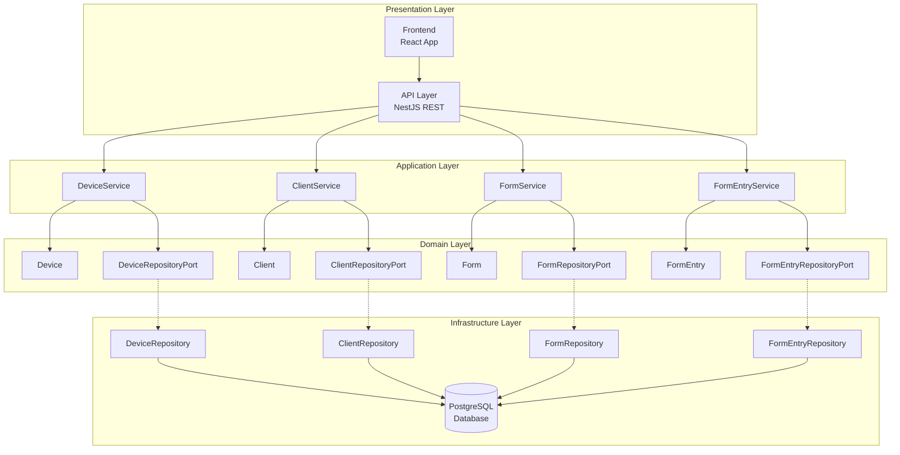

## Domain Model Relationships

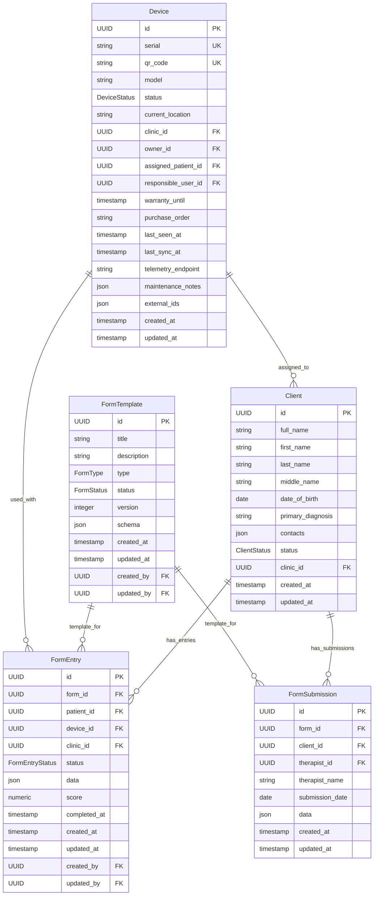

## Status Enumerations

### DeviceStatus

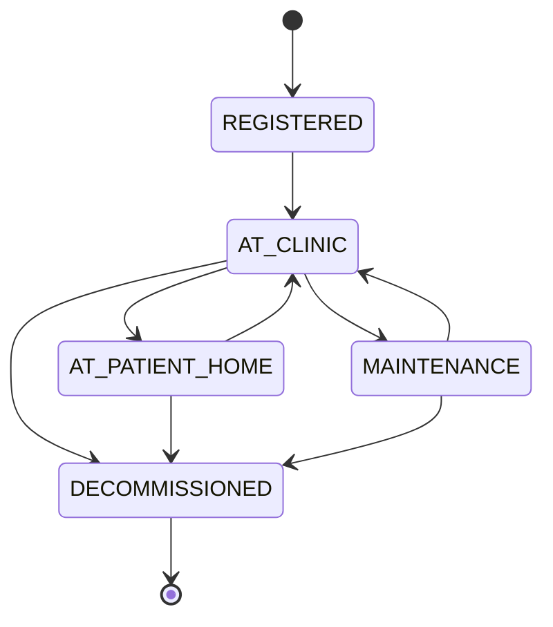

### ClientStatus

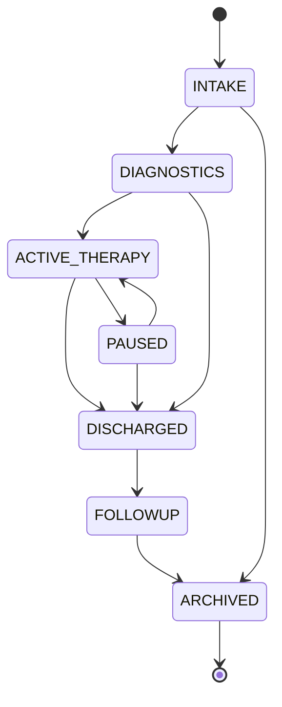

### FormEntryStatus

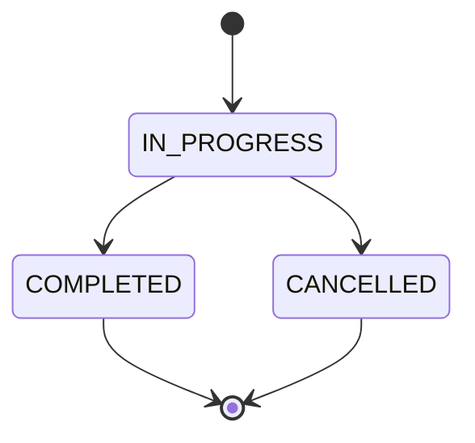

## API Architecture

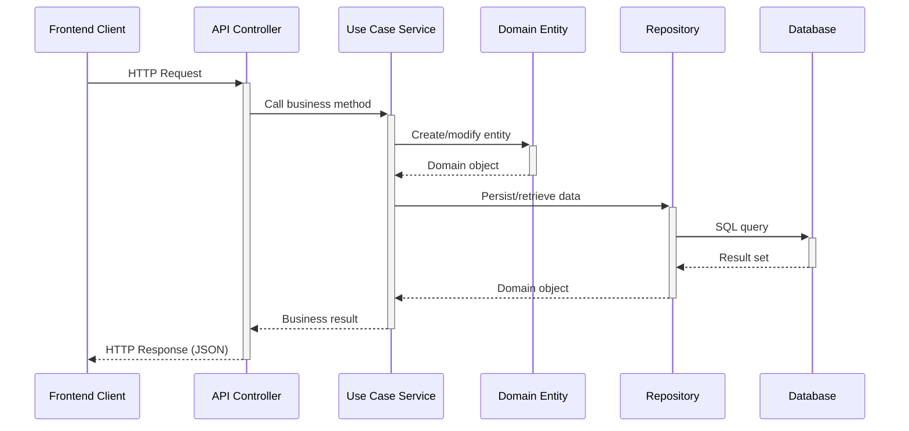

## Form System Architecture

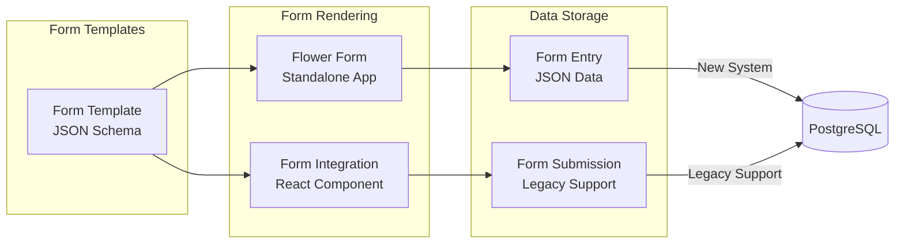

## Package Dependency Graph

```mermaid
graph TD
    API[📦 @reki/api]
    UC[📦 @reki/use-cases]
    DOMAIN[📦 @reki/domain]
    PERSISTENCE[📦 @reki/persistence]
    FRONTEND[📦 @reki/frontend]

    API --> UC
    API --> DOMAIN
    UC --> DOMAIN
    PERSISTENCE --> DOMAIN
    FRONTEND --> API

    subgraph "External Dependencies"
        NESTJS[NestJS]
        KNEX[Knex.js]
        REACT[React]
        PG[PostgreSQL]
    end

    API --> NESTJS
    UC --> NESTJS
    PERSISTENCE --> KNEX
    PERSISTENCE --> PG
    FRONTEND --> REACT

    style DOMAIN fill:#e1f5fe
    style API fill:#f3e5f5
    style UC fill:#e8f5e8
    style PERSISTENCE fill:#fff3e0
    style FRONTEND fill:#fce4ec
```

## Integration Patterns

### Repository Pattern Implementation

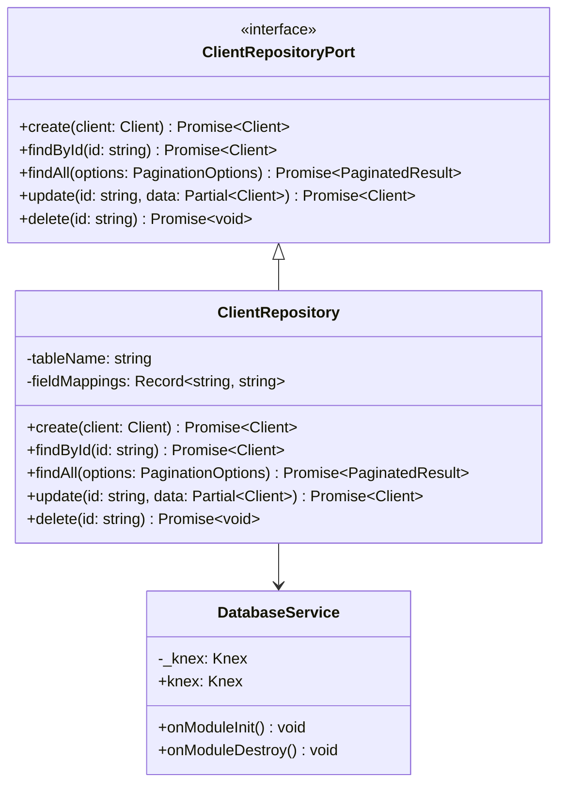

### Service Layer Pattern

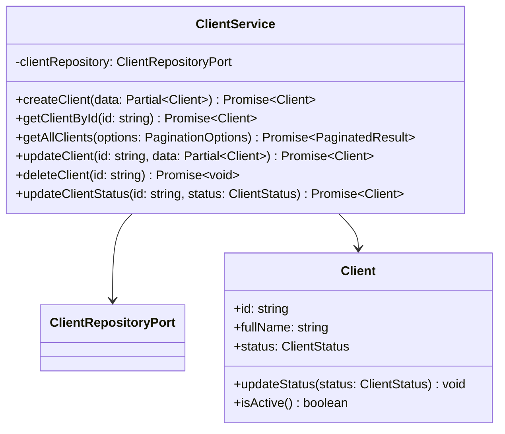

## Data Flow Patterns

### Form Submission Flow

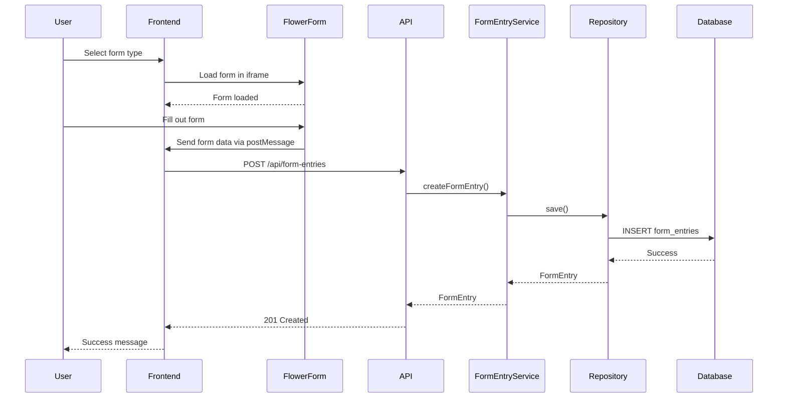

This UML documentation provides visual representations of the system architecture, relationships between components, and data flow patterns to help developers understand the system structure and interactions.
